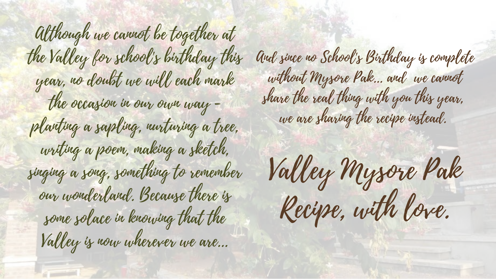

    <a href="/mysore-pak-recipe">Recipe Here</a>

<!-- [Click here to see the recipe](/mysore-pak-recipe) -->

<!-- ▹ Vegetarian, gluten-free, Valley-special\

**Servings:** 10\
**Cook Time:** 20-25 minutes\
**Setting Time:** 15-20 minutes\
**Total Time:** 35-45 minutes

| Ingredients needed                                                                                                                | Materials needed                                                                                                                                                       |
|-----------------------------------------------------------------------------------------------------------------------------------|------------------------------------------------------------------------------------------------------------------------------------------------------------------------|
| 150 grams besan/gram flour 300 grams sugar 400 ml refined oil 100 ml ghee Countless amount of Valley-love | 1 heavy bottom iron kadai 1 pan 1 steel spatula for stirring 1 tray 1 medium-sized bowl 1 medium-sized sieve An apron and gloves |

**Directions**

1. To make your nostalgic Valley Mysore Pak, start by sieving the besan/gram flour into a medium bowl. Sieve the flour twice to ensure there are no lumps.
2. Grease the tray with some ghee and set aside for later.
3. In a pan, heat the ghee till it melts. Gently add the oil to this. Bring this to a gentle boil.
4. To another heavy bottom kadai, add sugar and water. Bring this mixture to boil till the sugar dissolved in the water and you start seeing bubbles.
5. Now, to this bubbling sugar syrup, carefully add the besan little by little. You can add the besan in three parts. Remember, as you add the besan keep stirring using the steel spatula. Mix until there are no lumps and everything is well combined.
6. To this paste, slowly add the hot ghee and oil that you had warmed in the beginning. You can add the ghee and oil mixture in two parts. The trick is to keep mixing continuously till the ghee and oil get fully absorbed. At this stage, make sure that the paste does not stick to the pan.
7. While you are stirring, it is time to add lots of Valley-love to your smooth paste ☺
8. After a couple of minutes of stirring, you will notice the paste starts leaving the kadai. This is a sign that your Valley Mysore Pak is ready. You can turn off the flame at this point. You will realize how delicious this smells!
9. Using a spatula, transfer this paste into your tray that you greased at the beginning. Spread this delicious paste evenly.
10. Now keep this tray aside and let it set for about 20 minutes.
11. While your Valley Mysore Pak is setting, you can dive into your happy memories of having Mysore Pak in Valley. You could even sing few of your favorite song from Nan-Ninaad for some extra flavor.
12. Once the Valley Mysore Pak sets and firms, you can cut it into small pieces. Sprinkle some extra Valley-love on the top right before serving. This sweet is best enjoyed with family and friends!

**Notes**

1. Storage: best if enjoyed fresh. The Valley Mysore Pak can be stored for up to two weeks. But amongst friends and family this sweet is hard to resist and it won't last very long!
2. Note for children: if you wish to make this, make sure you do so with an adult and are careful.

**Fun fact**

Did you know, each year for the school’s birthday, about 6 kilos of Mysore Pak is made in the dining hall. For this, 5 kilos of besan, 10 kilos of sugar, 12 liters oil and 2 liters of ghee is used. The total cooking time is more than an 1 hour. -->
