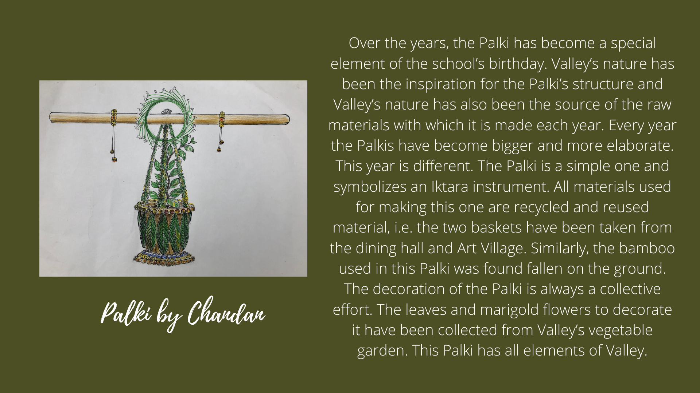

<!-- Over the years, the Palki has become a special element of the school’s birthday. Valley’s nature has been the inspiration for the Palki’s structure and Valley’s nature has also been the source of the raw materials with which it is made each year. Every year the Palkis have become bigger and more elaborate. This year is different. The Palki is a simple one and symbolizes an Iktara instrument. All materials used for making this one are recycled and reused material, i.e. the two baskets have been taken from the dining hall and Art Village. Similarly, the bamboo used in this Palki was found fallen on the ground. The decoration of the Palki is always a collective effort. The leaves and marigold flowers to decorate it have been collected from Valley’s vegetable garden. This Palki has all elements of Valley. -->
